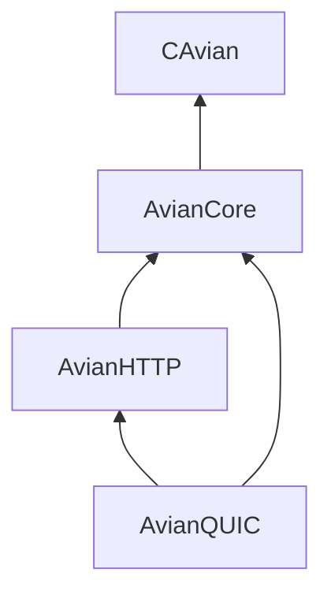

# aviancore

The protocol and systems layers of [Garuda](https://github.com/grepjava/garuda)
and [Peregrine](https://github.com/grepjava/peregrine), as a Swift package of
their own. It has syscalls, TLS and compression in C, buffers and a poller, and
HTTP/1.1, HTTP/2, HTTP/3, WebSocket framing and QUIC. It doesn't use Foundation
or SwiftNIO.

aviancore is not a server. It has no worker, connection table or dispatch; each
server builds its own on top of these modules.

## Modules

| Module | What it holds |
| --- | --- |
| `CAvian` | C shim: epoll/kqueue, sockets, signals, fork, `sendfile`, threads, TLS over TCP (`avian_tls.c`), crypto primitives for QUIC (`avian_crypto.c`), UDP with `recvmmsg` and GSO (`avian_udp.c`), ACME, gzip/brotli/zstd, file watching, the shared-memory tables for metrics, rate limiting and a response cache, and the broadcast ring that carries messages between worker processes |
| `AvianCore` | `ByteBuffer`, `BufferPool`, `Poller`, logging, civil time |
| `AvianHTTP` | HTTP/1.1 request parser, chunked decoder, response writer and parser, request writer, HPACK, QPACK, HTTP/2 and HTTP/3 framing, WebSocket framing and permessage-deflate, forwarded-header trust, cache policy, trace context |
| `AvianQUIC` | QUIC transport: packets, crypto, loss recovery, streams, the TLS 1.3 handshake |



Swift never imports an OpenSSL header. TLS sessions, contexts and keys are
opaque handles behind functions in the shim. Every C function and type is named
`av_`, and every macro `AV_`.

## Using it

```swift
// Package.swift
dependencies: [
    .package(url: "https://github.com/grepjava/aviancore", from: "0.1.0"),
],
targets: [
    .target(name: "MyServer", dependencies: [
        .product(name: "AvianCore", package: "aviancore"),
        .product(name: "AvianHTTP", package: "aviancore"),
    ]),
]
```

No target sets unsafe build flags, because SwiftPM refuses them in a package
that is depended on by version. A server that wants exclusivity checking off in
its release build passes the flag on the command line:

```bash
swift build -c release -Xswiftc -enforce-exclusivity=unchecked
```

The API is shaped by the servers that use it and changes with them. Until 1.0,
a minor version can break it. Pin a minor version with `.upToNextMinor(from:)`
if that matters to you.

## Requirements

- Swift 6.1 or newer, in Swift 6 language mode.
- Linux, or macOS 14 or newer.
- OpenSSL 3 and zlib development files. brotli and zstd are loaded at run time
  when present.

On macOS with Homebrew's OpenSSL:

```bash
brew install pkg-config openssl@3
swift build -Xcc -I"$(brew --prefix openssl@3)/include" \
            -Xlinker -L"$(brew --prefix openssl@3)/lib"
```

## Environment

| Variable | Effect |
| --- | --- |
| `AVIAN_UDP_GSO=0` | Sends one datagram per call even where the kernel supports UDP GSO |
| `AVIAN_NO_OPENAT2=1` | Resolves static files without `openat2`, as on kernels older than 5.6 |

## Tests

```bash
swift test                          # 302 unit tests
bash scripts/cache-unit-test.sh     # 7, the shared response cache under concurrent writers
bash scripts/bus-unit-test.sh       # the broadcast ring: racing and killed writers, wakes between processes
```

`scripts/gen-hpack-tables.py` and `scripts/gen-qpack-table.py` generate the
HPACK and QPACK static tables from independent implementations; their output is
committed.

The end-to-end suites exercise these layers through a running server, so they
live in the servers' repositories.

## License

MIT. See [LICENSE](LICENSE).
